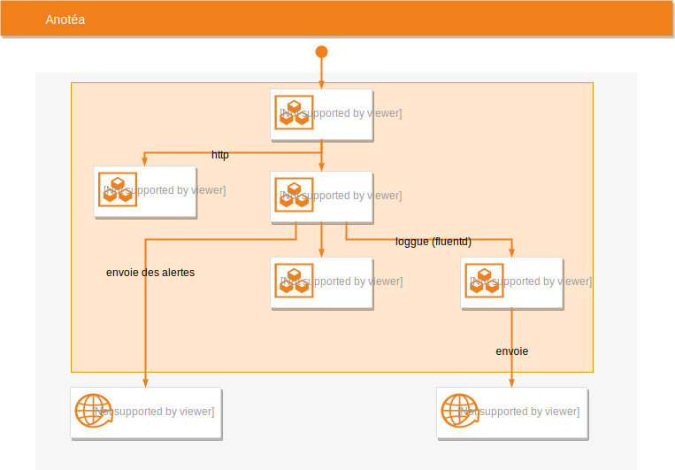

Anotéa est un service lancé par Pôle emploi permettant de collecter les avis de demandeurs d'emplois ayant suivis une formation.

Seules les personnes ayant effectué la formation reçoivent un questionnaire à compléter. 
Vous êtes donc certains que les avis que vous consultez sont fiables.

## Comment cela fonctionne-t-il ?

Dans le cadre de sa recherche d'emploi, une personne peut suivre une formation financée par Pôle Emploi et/ou par la région dans laquelle il habite.

Lorsque la formation est terminée, Anotéa envoie par mail un questionnaire à cette personne — qu'on appelle stagiaire —  pourqu'il puisse déposer un avis sur la formation (la réponse à ce questionnaire est facultative).

Une fois l'avis déposé et anonymisé, il est potentiellement consultable sur tous les sites qui utilisent Anotéa (ex: https://labonneformation.pole-emploi.fr)

Afin de récupérer les avis, ces sites peuvent utiliser deux canaux fournis par Anotéa : l'[api](API.md) et le [widget](WIDGET.md)

### En détails 


#### Réconciliation

Les formations suivies par les stagiaires sont référencées dans un catalogue.

Chaque formation peut être dispensée par plusieurs organismes formateurs, dans plusieurs lieux et à des dates différentes.

Quand un stagiaire dépose un avis sur une formation, il le fait donc pour

 1. un organisme formateur
 2. un lieu de formation (ex: 45000)
 3. une période (ex: du 01/01/2018 au 31/01/2018).

Ces trois critères représentent une session de formation. 

Le stagiaire étant contacté à la fin de la session, l'avis est donc déposé sur une session terminée. 

Le but de la réconciliation va être d'identifier dans le catalogue de formations, des sessions similaires en cours ou à venir. 
Une session est considérée comme similaire si elle possède
 
 - le même `siren` que l'organisme formateur
 - le même lieu de formation (`code postal`)
 - au moins un `formacode` ou `certifinfo` identique
        
Une fois que les sessions ont été identifiées, l'avis déposé est alors rattaché à ces sessions.

Les améliorations apportées à la réconciliation sont listées dans le [CHANGELOG](CHANGELOG.md#Réconciliation) 

## Développement
Travis Status 

Anotéa nécessite que MongoDB 4+ soit démarré sur le port 27017 et que node.js 12 soit installé. 

Anotea est composé de deux projets : 
- `backend` qui contient un serveur node.js et expose des serveurs via [une API](API.md)
- `ui` qui contient les interfaces graphiques

### Démarrer l'application

Chaque projet se démarre avec les commandes suivantes :

```
npm install
npm start
```

Par défaut les deux projets sont configurés pour prendre en compte automatiquement les modifications du code source.

#### Jeu de données

Vous pouvez créer un jeu de données en local au moyen de la commande suivante:

```
cd backend
node src/jobs/data/dataset --drop
```

Ce script va générer un ensemble de données permettant à l'application de fonctionner.
Le sortie console du script vous donnera les instructions pour vous connecter à l'application.

#### Mode développement avancé

Afin d'éviter de devoir lancer les deux projets à la main, il est possible de les démarrer en une seule commande.

Ce script utilise `pm2`, il est donc nécessaire de l'installer auparavant

```
npm install pm2 -g
```

puis 
 
```
bash dev.sh
```

Pour éviter que le script installe les dépendances npm à chaque fois:

```
SKIP_NPM_INSTALL=true bash dev.sh
```

#### Docker

Il est possible de démarrer Anotéa au sein de containers Docker.

Cette option permet d'avoir une environnement quasiment identique à celui de la production (reverse proxy,...).

Nous l'utilisons la plupart du temps pour reproduire une anomalie liée au déploiement.

```
docker-compose up --build
```

Cette commande va construire et démarrer plusieurs containers :

- Un container `nginx`, reverse proxy qui est le point d'entrée de l'application pour tous les appels http
- Un container `backend` contenant le serveur node.js
- Un container `ui` contenant les interfaces graphiques
- Un container `mongodb`  
- Des containers pour gérer les logs (EFK)  



L'application est ensuite accessible à l'url `http://localhost`

Pour executer un script dans un conteneur Docker, il faut lancer la commande :

```sh
docker build -t anotea_script .
docker run anotea_script bash -c "node src/jobs/<nom du script>"
```

Il est possible de fournir une configuration spécifique dans le fichier `docker-compose.local.yml` :

```sh
docker-compose -f docker-compose.yml -f docker-compose.local.yml up
```

Les fichiers seront fusionnés avec la configuration par défaut.

Vous pouvez prendre exemple sur les fichiers `docker-compose.override.yml` et `docker-compose.test.yml`.

Pour information, c'est le mécanisme utilisé pour configurer les différents environnements.

Pour plus d'informations sur le mécanisme de surcharge de docker-compose voir [https://docs.docker.com/compose/extends/](https://docs.docker.com/compose/extends/) 

#### Envoyer des emails en local

Certains fonctionnalités envoient des emails et ont donc besoin d'un serveur SMTP.
Vous pouvez démarrer en local un serveur MailHog :

```
cd backend
npm run smtp:start
```

Si vous avez démarré l'application via Docker un container MailHog est automatiquement lancé. 


### Tests

Par défaut, les tests d'intégration utilisent la base MongoDB démarrée sur la port 27017.
Afin que les tests s'éxecutent rapidement, vous pouvez démarrer un MongoDB in-memory :

```
mongod --dbpath <path to data dir> --port 27018 --storageEngine=ephemeralForTest
```

Vous pouvez ensuite lancer les tests avec la commande suivante :

```
cd backend
ANOTEA_MONGODB_URI=mongodb://localhost:27018/anotea?w=1 npm run test
```

Pour information, c'est le mécanisme utilisé pour executer les tests d'intégration sur Travis.

<p align="center">

</p>
