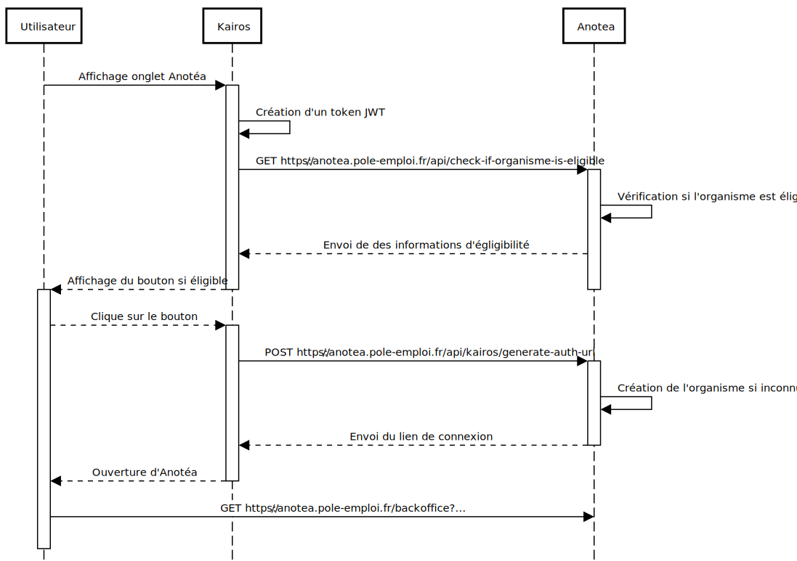

# API

Anotea expose plusieurs API web :

## API publique (v1)

L'API publique groupe tous les services permettant de consulter les avis déposés par les stagiaires.

Elle est disponible sur l'Emploi Store Dev (https://francetravail.io/data/api/anotea)

La documentation Swagger est disponible à l'url suivante https://anotea.francetravail.fr/api/v1/doc

### Authentification

Cette API requière une authentification de type HMAC.

Le header Authorization doit être de la forme suivante :

```
Authorization: "ANOTEA-HMAC-SHA256 <api_key>:<timestamp>:<digest>"
```

- `api_key` : Votre API Key.
- `timestamp` :  Nombre de millisecondes depuis l'Unix Epoch UTC.
- `digest` :  Digest spécifique à l'appel.
  
Le digest doit être créé en générant, à partir de votre secret, un HMAC SHA256 de la chaine de caractères composée des informations suivantes concaténées dans l'ordre :

`digest = "timestamp + method + path + body"`

- `timestamp` :  Nombre de millisecondes depuis l'Unix Epoch UTC.
- `body` : Le body de la requête (ex: json) ou rien s'il n'y a pas de body (ex: requête GET)
- `method`: La méthode de la requête en upper case (ex: GET)
- `path` : Le chemin de la route avec les parameters (ex: /api/v1/ping/authenticated?value=1)

La durée de validité du digest est de 5 minutes.

Exemple d'appel:

```sh
curl -X GET \
https://anotea.francetravail.fr/api/v1/ping/authenticated \
-H 'Authorization: ANOTEA-HMAC-SHA256 admin:1532004499293:217e41887152c459e34bd7070ab1ac8da572c1cf6107cafbbd0217d4b87db1a4'
```

## Kairos

Cette API permet aux utilisateurs de l'application Kairos de se connecter automatiquement à Anotéa.

Le documentation Swagger est disponible à l'url suivante https://anotea.francetravail.fr/api/kairos/doc

Le processus d'authentification est le suivant :



### Authentification

Cette API requière une authentification de type JWT.

Le header Authorization doit être de la forme suivante :

```
Authorization: "Bearer <token>"
```

Le token doit être crée en générant un token JWT avec les claims iat et sub et le signant avec votre secret via l'algorithme HMAC256.

- `iat` : Nombre de secondes depuis l'Unix Epoch UTC.
- `sub` : Votre API Key


## Backoffice

L'API backoffice fournit les outils permettant aux modérateurs, financeurs et organismes de gérer les avis.
Cette API est privée et n'a pas pour l'instant vocation à être consommée par un partenaire externe.

### Authentification

Cette API requière une authentification de type JWT.

Le header Authorization est de la forme suivante :

```
Authorization: "Bearer <token>"
```